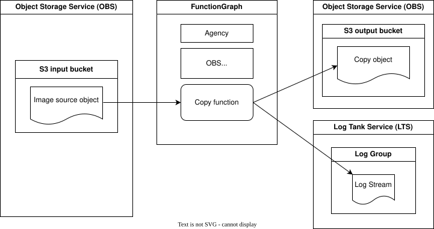

# Event-obss3-copy

This is a sample that processes an image uploaded to OBS and uploads the image back to another OBS using FunctionGraph with OBS trigger event.

The start of the process is initiated by an `S3TriggerEvent` in FunctionGraph.


## Overview

Following diagram shows components used in this example:



## Deploy to Cloud

This sample can be deployed using Terraform.
(for setup see: [Prepare the Terraform environment](https://opentelekomcloud-community.github.io/otc-functiongraph-php-runtime/devguide/deployment/terraform/setuptf.html))

To deploy using Terraform, run in project folder:

```
make tf_apply
```


**Remark:**

The script creates an agency with permissions for function to access obs bucket objects.
After creating it takes a while until the agency is active.
Until then the function will log a 403 error.